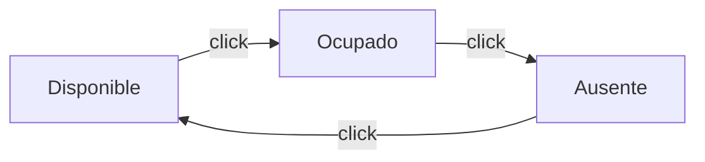
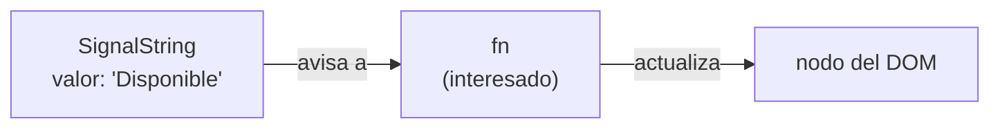
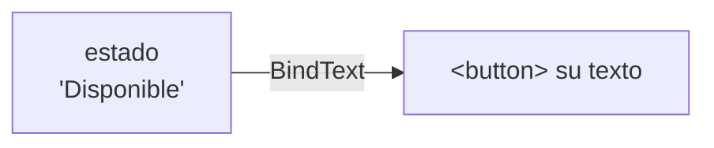
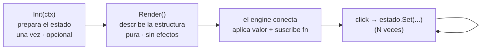
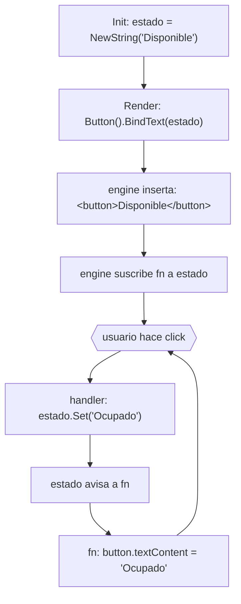

# Binding Model — Cómo funciona la reactividad

Este documento explica el **modelo mental** de los signals y bindings de `tinywasm/dom`.
Léelo antes de la referencia de API.

Usamos **un solo botón** como hilo conductor del núcleo, y al final una **lista de tareas**
para las piezas que faltan (input, listas, condicionales).

---

## El caso práctico: un botón de estado

Un botón que muestra tu disponibilidad. Cada vez que lo presionas, rota:
**Disponible → Ocupado → Ausente → Disponible…** El texto del botón es siempre el estado actual.



Sencillo, pero tiene lo esencial: un dato que cambia y una pantalla que debe reflejarlo.

---

## La idea central: un Signal es una "caja que avisa"

Un `SignalString` es un `string` guardado en una caja que **avisa a quien le interese** cuando
su valor cambia:



Cuando llamas `estado.Set("Ocupado")`:
1. El valor de la caja pasa a `"Ocupado"`.
2. Llama a cada función de la lista de interesados.
3. Esa función actualiza **un solo nodo del DOM** (el texto del botón).

No hay comparación de árboles ni Virtual DOM: el cambio va directo al nodo. Es O(1) por binding.

---

## El botón, completo

Un componente implementa dos métodos: `Render()` (obligatorio) e `Init(ctx)` (opcional). Nada más.

```go
type BotonEstado struct {
    dom.Element
    estado *dom.SignalString   // el dato que la UI muestra vive en un signal, no en un campo normal
}

func (b *BotonEstado) Init(_ dom.Ctx) {
    b.estado = dom.NewString("Disponible")    // arranca en "Disponible"
}

func (b *BotonEstado) Render() *dom.Element {
    return dom.Button().
        BindText(b.estado).                       // "el texto del botón sigue a estado"
        On("click", func(dom.Event) {
            b.estado.Set(siguiente(b.estado.Get()))  // cambia el signal → la UI se actualiza sola
        })
}

// siguiente rota el estado. switch, no map (idioma TinyGo).
func siguiente(s string) string {
    switch s {
    case "Disponible": return "Ocupado"
    case "Ocupado":    return "Ausente"
    default:           return "Disponible"
    }
}
```

El handler solo cambia el signal. No hay que avisar a la pantalla ni redibujar nada: el signal
se encarga.

### ¿Qué es un binding?

Un **binding** es la conexión que declaras entre un signal y **un lugar concreto del DOM**:



`BindText(b.estado)` deja anotado "este botón mostrará el valor de estado". El engine lo conecta
al insertar el botón en la página, y desde entonces mantiene el texto sincronizado con el signal.

### Por qué dos métodos: `Init` y `Render` no son lo mismo

Un componente tiene a lo sumo dos métodos, con **roles distintos** (no es repetición):

- **`Render()` — QUÉ se ve.** Una función **pura**: lee los signals y devuelve la estructura.
  No tiene efectos. El engine la vuelve a llamar si un subárbol se re-monta (p. ej. dentro de
  `Show`). Por eso **no** puedes crear los signals aquí: se recrearían en cada montaje.
- **`Init(ctx)` — la preparación.** **Imperativa** y corre **exactamente una vez**, antes del
  primer render: crea los signals, carga localStorage, hace fetch, registra limpieza con
  `ctx.OnCleanup`. Es **opcional** — si no hay preparación, no lo escribes.

En una frase: `Init` prepara el estado (una vez); `Render` lo dibuja (cada vez que se monta).

### El ciclo de vida



1. **`Init(ctx)`** — crea los signals y carga datos externos. `b.estado = dom.NewString("Disponible")`.

2. **`Render()`** — describe la estructura y declara los bindings. No se vuelve a llamar cuando el
   valor cambia (para eso está el signal); sí se re-ejecuta si el subárbol se re-monta.

3. **El engine conecta (wiring)** — tras insertar el HTML:
   - escribe el valor actual: `<button>Disponible</button>`,
   - y registra una función en la lista de interesados de `estado`.

   A partir de ahí, cada `estado.Set("Ocupado")` ejecuta esa función →
   `button.textContent = "Ocupado"`.

### El flujo completo



El componente no se re-dibuja. Solo cambia el texto del botón.

---

## Texto calculado: `BindText` vs `BindTextFunc`

Seguimos con el mismo botón. A veces el texto no es el signal *tal cual*, sino algo **calculado**
a partir de él. Compara:

```go
// DIRECTO: el botón muestra el estado exacto del signal.
dom.Button().BindText(b.estado)            // "Disponible", "Ocupado"…

// CALCULADO: el botón muestra una frase construida a partir del signal.
dom.Button().BindTextFunc(func() string {
    return "Estado: " + b.estado.Get()     // "Estado: Disponible", "Estado: Ocupado"…
})
```

`BindTextFunc(fn)` recibe una **función** que puede leer uno o varios signals.

### ¿Cómo sabe a qué signals reaccionar? (auto-tracking)

No declaras una lista de dependencias. El engine lo descubre solo:

```
1. El engine ejecuta tu función una vez, "vigilando".
2. Cada b.estado.Get() dentro de la función anota: "esta función depende de estado".
3. Listo: cuando estado cambie, la función se re-ejecuta y el nodo se actualiza.
```

Si la función lee dos signals, reacciona a los dos. Es **imposible olvidar una dependencia**
porque nunca la escribes a mano — leer el signal con `.Get()` ya lo conecta.

### `DeriveString` — un cálculo con nombre, reutilizable

Si el **mismo** valor calculado se usa en **varios** lugares, dale un nombre con `DeriveString`
para no repetir la función:

```go
// El color según el estado, usado en dos sitios a la vez.
color := dom.DeriveString(func() string {
    switch b.estado.Get() {
    case "Disponible": return "verde"
    case "Ocupado":    return "rojo"
    default:           return "gris"
    }
})

dom.Button().
    BindAttr("data-color", color).      // como atributo
    BindAttr("title", color)            // y en el tooltip — sin recalcular dos veces
```

---

## Input, listas y condicionales (una lista de tareas)

Ya entiendes el núcleo. Las piezas restantes se ven mejor con un ejemplo conocido:
**agregar tareas a una lista**.

```go
type ListaTareas struct {
    dom.Element
    nueva  *dom.SignalString   // texto del input
    tareas *dom.SignalNodes    // las filas de la lista
    vacia  *dom.SignalBool     // ¿la lista está vacía?
}

func (t *ListaTareas) Init(_ dom.Ctx) {
    t.nueva  = dom.NewString("")
    t.tareas = dom.NewNodes()
    t.vacia  = dom.NewBool(true)
}
```

### Input de dos vías: `Bind`

```go
dom.Input("text").Bind(t.nueva).Autofocus()
```

- Cuando el usuario **escribe**, el signal `t.nueva` recibe el texto automáticamente.
- Cuando el código cambia el signal, el input se actualiza — **pero no mientras el usuario está
  escribiendo en él** (el engine lo detecta), así nunca se interrumpe un acento o caracter CJK.
- El nodo `<input>` nunca se reemplaza: el cursor jamás salta.

`Autofocus()` pone el foco en el input cuando aparece, **solo si nada más tiene foco** (no te lo
roba mientras escribes en otro lado).

### Lista reactiva: `BindChildren`

La lista de tareas es un `SignalNodes` (un signal cuyo valor es una lista de elementos):

```go
ul := dom.Ul().BindChildren(t.tareas)

// En el handler del botón "Agregar":
On("click", func(dom.Event) {
    t.tareas.Set(construirFilas(/* tareas + la nueva */))
    t.vacia.Set(false)
})

func construirFilas(items []string) []*dom.Element {
    filas := make([]*dom.Element, len(items))
    for i, texto := range items {
        filas[i] = dom.Li().Text(texto).Key(texto)   // .Key() = identidad estable de la fila
    }
    return filas
}
```

`BindChildren` compara por `.Key(...)`: **inserta solo la fila nueva**, no vuelve a dibujar las
existentes. Si quitas una, solo esa desaparece. Las demás conservan su identidad en el DOM.

### Subárbol condicional: `Show`

Mostrar un mensaje "No hay tareas" **solo** cuando la lista está vacía:

```go
dom.Show(t.vacia, func() *dom.Element {
    return dom.P().Text("No hay tareas todavía")
})
```

`Show` recibe un `*SignalBool` y una **función** que construye el contenido:

- `vacia == true` → llama la función, inserta el `<p>`, conecta sus bindings.
- `vacia == false` → desmonta el `<p>`, ejecuta limpieza, cancela sus suscripciones (sin fugas).

**Por qué una función y no un elemento directo:** el `<p>` se construye solo cuando hace falta;
si la lista nunca está vacía, ese nodo jamás se crea.

### Clases y atributos que dependen de un bool

```go
dom.Button().
    BindAttrBool("disabled", t.vacia).      // botón "Limpiar" deshabilitado si está vacía
    BindClass("lista--vacia", t.vacia)      // clase CSS que aparece/desaparece según el bool
```

---

## Limpieza: `ctx.OnCleanup`

Si en `Init` arrancas algo que vive fuera del componente (un timer, un websocket, un listener
global), regístralo para que se detenga cuando el componente se desmonte:

```go
func (b *BotonEstado) Init(ctx dom.Ctx) {
    b.estado = dom.NewString("Disponible")
    stop := arrancarSondeo(func(nuevo string) { b.estado.Set(nuevo) }) // p. ej. cada 30s
    ctx.OnCleanup(stop)                                                 // se llama al desmontar
}
```

Puedes llamar `estado.Set(...)` desde una goroutine o un callback: el binding se actualiza igual.

---

## Guía rápida: ¿qué uso para…?

| Quiero… | Signal | Binding |
|---|---|---|
| Mostrar un texto que cambia | `*SignalString` | `.BindText(s)` |
| Mostrar texto calculado de varios datos | — | `.BindTextFunc(fn)` |
| Reutilizar un cálculo en varios nodos | `DeriveString(fn)` | `.BindText(derived)` |
| Un atributo (`title`, `href`…) | `*SignalString` | `.BindAttr("title", s)` |
| Una clase CSS on/off | `*SignalBool` | `.BindClass("activa", b)` |
| `disabled`, `checked`, `hidden`… | `*SignalBool` | `.BindAttrBool("disabled", b)` |
| Un input editable por el usuario | `*SignalString` | `.Bind(s)` |
| Una lista de filas | `*SignalNodes` | `.BindChildren(rows)` |
| Mostrar/ocultar un bloque | `*SignalBool` | `dom.Show(b, fn)` |
| Dar foco al aparecer | — | `.Autofocus()` |
| Detener recursos al desmontar | — | `ctx.OnCleanup(fn)` |

---

## Siguiente paso

¿Por qué esta arquitectura y no otra? Pros, contras y comparación con re-render completo y Virtual
DOM en [TRADEOFFS.md](./TRADEOFFS.md).
