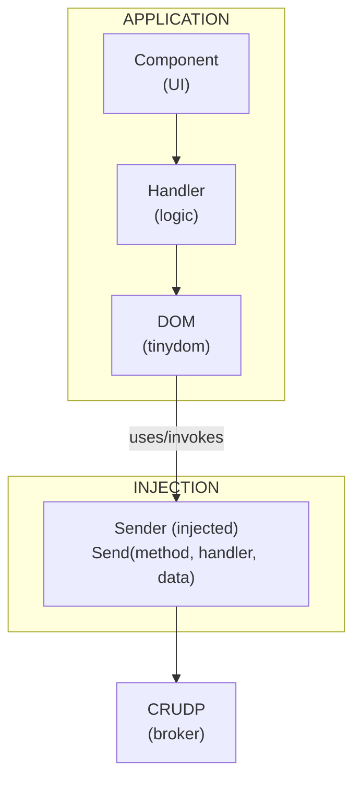

# TinyDOM Roadmap

> **Status:** Feature Planning  
> **Last Updated:** December 2025

## Overview

This document tracks new features required for CRUDP integration. TinyDOM needs to support network communication and form validation while maintaining its minimal, TinyGo-optimized design.

## New Features

| Priority | Feature | Status | Document |
|----------|---------|--------|----------|
| P0 | Sender Interface | 📋 Planned | [FEAT_001](issues/FEAT_001_SENDER_INTERFACE.md) |
| P1 | Form Validation | 📋 Planned | [FEAT_002](issues/FEAT_002_FORM_VALIDATION.md) |
| P1 | Debounce Config | 📋 Planned | [FEAT_003](issues/FEAT_003_DEBOUNCE_CONFIG.md) |
| P2 | Message Display | 📋 Planned | [FEAT_004](issues/FEAT_004_MESSAGE_DISPLAY.md) |

## Architecture Integration



## Design Principles

1. **No CRUDP dependency:** TinyDOM defines interfaces, CRUDP implements them
2. **No maps:** Slices only for TinyGo compatibility
3. **Minimal API:** Add only what's necessary
4. **Callback-based:** Async operations use callbacks, not channels

## HTTP Method Constants

TinyDOM will export standard HTTP method constants:

```go
// methods.go
const (
    POST   = "POST"
    GET    = "GET"
    PUT    = "PUT"
    DELETE = "DELETE"
)
```

## Dependencies

- `github.com/cdvelop/tinystring` - Errors, string utilities

## Related

- [CRUDP Architecture](https://github.com/cdvelop/crudp/blob/main/docs/ARQUITECTURE.md)
