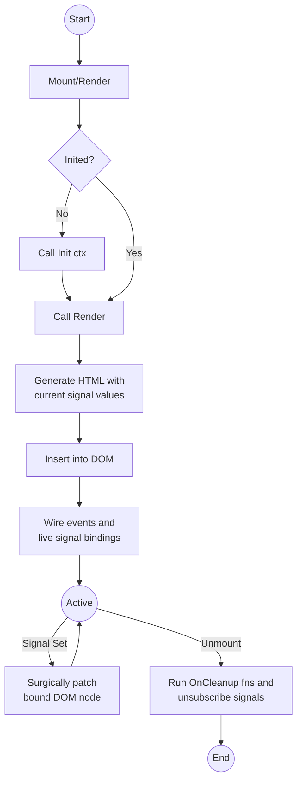

# Component Lifecycle

```mermaid
flowchart TD
    Start((Start)) --> Mount[Mount/Render]
    Mount --> Inited{Inited?}
    Inited -- No --> Init[Call Init ctx]
    Init --> Render[Call Render]
    Inited -- Yes --> Render
    Render --> HTML[Generate HTML with<br/>current signal values]
    HTML --> Insert[Insert into DOM]
    Insert --> Wire[Wire events and<br/>live signal bindings]
    Wire --> Active((Active))

    Active -- Signal Set --> Patch[Surgically patch<br/>bound DOM node]
    Patch --> Active

    Active -- Unmount --> Cleanup[Run OnCleanup fns and<br/>unsubscribe signals]
    Cleanup --> End((End))
```
